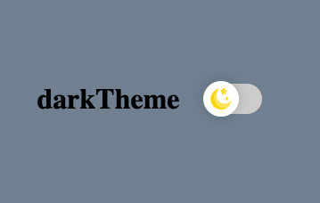
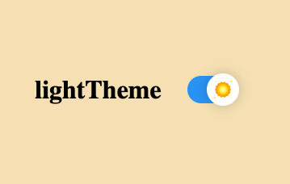

# Simple animated theme switch component

Created with create-react-app and uses Styled Components

### Instructions

1. git clone repo
2. npm install
3. npm start
4. Open browser and go to http://localhost:3000

### Screenshot - Dark Theme

### Screenshot - Light Theme

